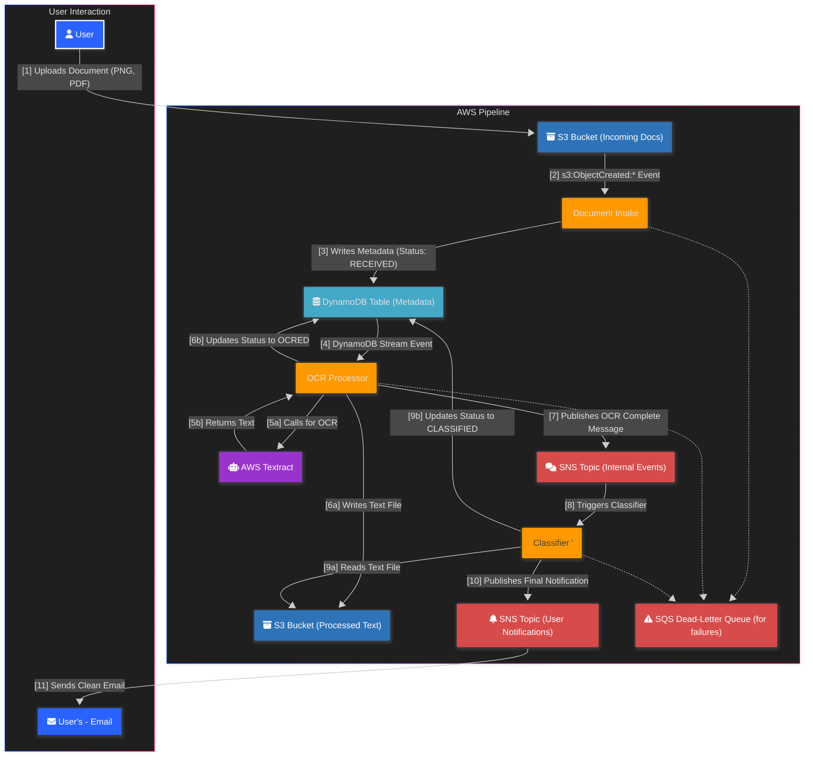

# Serverless Document Processing Pipeline on AWS

This project is a complete, event-driven, and resilient serverless pipeline built on AWS to automatically process, analyze, and classify documents. It ingests images and PDFs, uses AI-powered OCR to extract text, classifies the document type, and sends notifications upon completion.

This repository contains all the application code and Infrastructure as Code (IaC) templates needed to deploy the entire solution using the AWS SAM CLI.

---

## Architecture Diagram

The final architecture is fully decoupled, using SNS to separate the OCR and Classification stages for maximum resilience.



## Features

- **Event-Driven:** The entire pipeline is triggered by S3 upload events.
- **Serverless:** Built entirely on managed services (Lambda, S3, DynamoDB, SNS, Textract). No servers to manage.
- **Resilient:** Uses SNS for decoupling and robust error handling in the Lambda functions to prevent pipeline failures from "poison pill" messages.
- **AI-Powered OCR:** Leverages AWS Textract to accurately extract text from various document formats.
- **Automated Classification:** Simple, rule-based logic to classify documents into categories.
- **Infrastructure as Code (IaC):** The entire architecture is defined in an AWS SAM template (`template.yaml`) for repeatable deployments.

## Tech Stack

- **Compute:** AWS Lambda (Python 3.11)
- **Storage:** Amazon S3 & Amazon DynamoDB
- **AI / OCR:** AWS Textract
- **Messaging & Decoupling:** Amazon SNS
- **Infrastructure as Code:** AWS SAM / CloudFormation
- **CI/CD:** GitHub Actions (Example workflow included)

## Setup and Deployment

### Prerequisites

- AWS Account & IAM User with programmatic access
- AWS CLI configured (`aws configure`)
- AWS SAM CLI
- Python 3.11
- Docker Desktop

### Deployment Steps

1.  **Clone the repository:**
    ```bash
    git clone https://github.com/sammedsc45/serverless-document-pipeline.git
    cd serverless-document-pipeline
    ```

2.  **Run the guided deployment:**
    The first deployment must be guided to create the `samconfig.toml` file and set the correct parameters. You will be prompted to provide names for your S3 buckets and DynamoDB table.

    ```bash
    sam deploy --guided
    ```

3.  **Subscribe to the Notification Topic:**
    - Navigate to the **AWS SNS Console**.
    - Find the topic named **`UserNotificationTopic`**.
    - Create a subscription, select **Email** as the protocol, and enter your email address.
    - Confirm the subscription by clicking the link in the email you receive.

## Usage

To use the pipeline, simply upload a supported file (PNG, JPEG, PDF) to the incoming S3 bucket.

```bash
# Replace with the name of your incoming bucket
aws s3 cp test_documents/invoice-test.png s3://your-incoming-bucket-name/
```

After about a minute, you should receive a formatted email notification confirming the document has been classified.

## Cleanup

To avoid ongoing AWS charges, you can delete all the resources created by this project.

1.  **Empty the S3 buckets:**
    ```bash
    aws s3 rm s3://your-incoming-bucket-name/ --recursive
    aws s3 rm s3://your-processed-bucket-name/ --recursive
    ```

2.  **Delete the SAM stack:**
    ```bash
    sam delete
    ```
